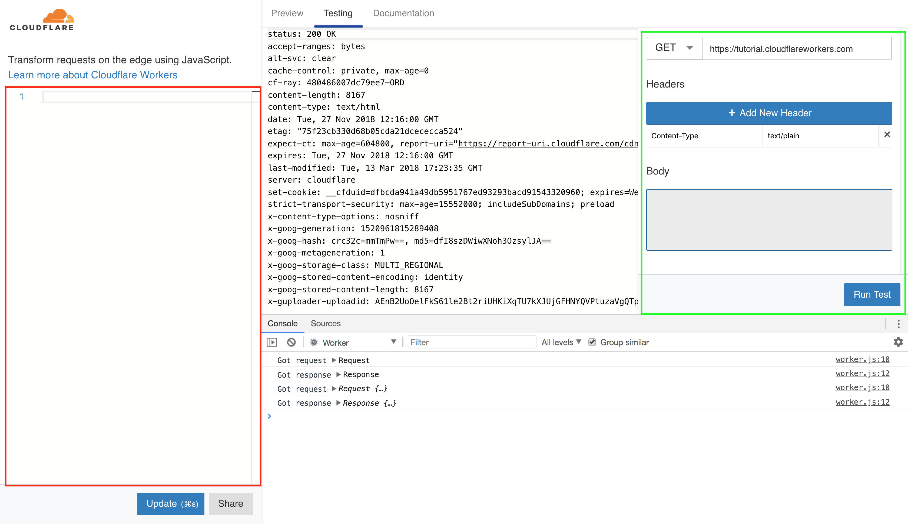

Hi ! In this post, I'Il show you how I saved $$$ by using Cloudflare Workers instead of AWS's API-Gateway to proxy requests to my AWS Lambda functions.

### Why use Cloudflare Workers ?

It's all about the cost. 10 million api requests will cost you :

- With API-Gateway: $35
- With Cloudflare Workers: $5

That is a **$30** difference !!

## Getting Started

First, create a new node project, in this blog post I'il be using `yarn`:

```bash
mkdir worker-proj
cd worker-proj
yarn init -y
```

then install some dev packages that we'il need mainly for bundling our worker:

```bash
yarn add dotenv-webpack webpack webpack-cli -D
```

also we need `aws4` to sign our requests to aws:

```bash
yarn add aws4
```

## Webpack config

We're using webpack in order to bundle our code and use it as a worker.

Create a new file in the project and call it `webpack.config.js`, and paste the following code into it:

```javascript
const Dotenv = require('dotenv-webpack')

module.exports = {
  entry: './worker.js', // This will be our entry file
  mode: 'production', // We're building for production to optimize our worker
  plugins: [new Dotenv()], // We'il be using a .env file to store our TOKENS
  optimization: {
    minimize: true,
  },
  performance: {
    hints: false,
  },
  output: {
    path: __dirname + '/dist', // this is the output folder
    publicPath: 'dist',
    filename: 'worker.js', // and this is where our final code will be at.
  },
}
```

## The Tokens we need

We need to specify 4 essential params:

- **ACCESS_KEY, SECRET**: Get them from AWS IAM.
- **REGION**: The region where our Lambda func lives.
- **FUNCTION**: AWS Function name.

once you have all these params, create a `.env` file and **add them to it**.

## Writing the worker

First, create a file, we'il name it _worker.js_.
Then, import `aws4` and create a `credentials` object to store our AWS keys:

```javascript
import aws4 from 'aws4'

const credentials = {
  accessKeyId: process.env.ACCESS_KEY,
  secretAccessKey: process.env.SECRET,
}
```

Now we write our worker function. It accepts a `request` param and returns the `response` of a request sent to our Lambda function.

```javascript
async function worker(request) {
  const reader = request.body.getReader()
  // getPayloadFromReader is a function that we use to get the body of a request
  const payload = await getPayloadFromReader(reader)
  // we sign our request using the credentiels we created earlier
  const req = aws4.sign(
    {
      method: 'POST',
      service: 'lambda',
      region: process.env.REGION,
      path: `/2015-03-31/functions/${process.env.FUNCTION}/invocations/`,
      body: JSON.stringify({ httpMethod: 'POST', body: payload }),
    },
    credentials
  )
  // then we send the signed request to the lambda function and return the response
  return fetch(`https://${req.hostname}/${req.path}`, {
    method: req.method,
    headers: req.headers,
    body: req.body,
  })
}

// The next 3 lines show you how to invoke a worker function using Cloudflare Workers
addEventListener('fetch', event => {
  event.respondWith(worker(event.request))
})
```

As for `getPayloadFromReader`:

```javascript
function binary_to_string(array) {
  // We need this function to convert binary to string
  var result = ``
  for (var i = 0; i < array.length; ++i) {
    result += String.fromCharCode(array[i])
  }
  return result
}

async function getPayloadFromReader(reader) {
  let payload = ''
  while (true) {
    let { done, value } = await reader.read()
    if (done) {
      break
    }
    payload = payload + binary_to_string(value)
  }
  return payload
}
```

## Time to test !

To test what we've done so far, add the `build` script to your package.json:

```json
{
  "name": "worker",
  "version": "1.0.0",
  "main": "worker.js",
  "license": "MIT",
  "scripts": {
    "build": "webpack -p --progress --colors"
  },
  "dependencies": {
    "aws4": "^1.8.0"
  },
  "devDependencies": {
    "dotenv-webpack": "^1.5.7",
    "webpack": "^4.25.1",
    "webpack-cli": "^3.1.2"
  }
}
```

and run `yarn build`, then copy the code that'Il find in `dist/worker.js`.

Once you copy the worker code, head to https://cloudflareworkers.com and paste the worker code in the red-bordered section then click on `update`.


In the right section _(green-bordered)_ of the screenshot above you can see test different kinds of requests.

## Conclusion

Now you can stop using API Gateway and save some money !!

Have a great week !
