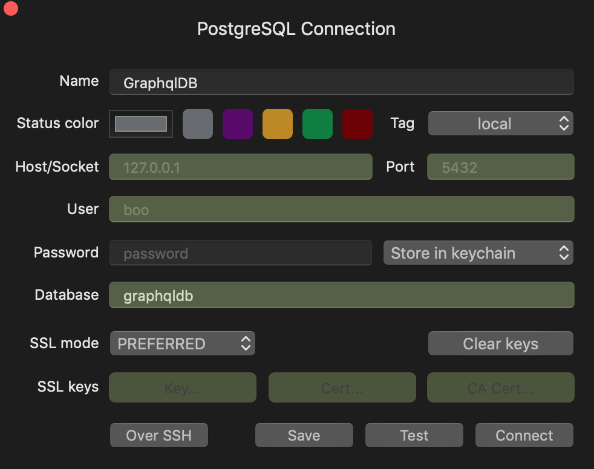
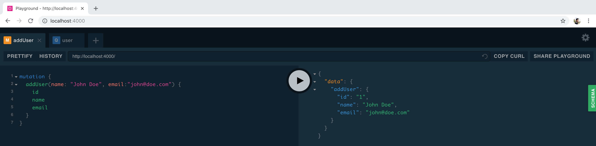
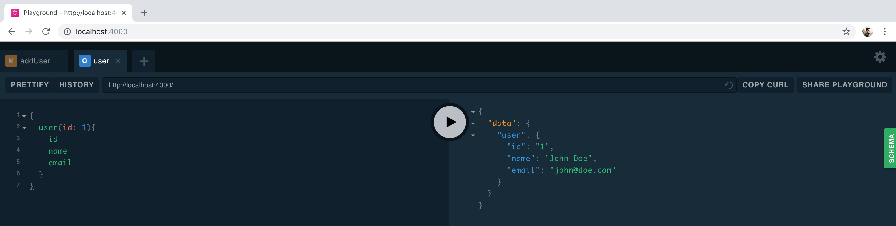

Hi ! In this post, I'Il show you how I to setup PostgreSQL with TypeORM in a GraphQL server. This is the backend setup that I usually use for my backend's side projects.

This tutorial is focused on MacOS environment 🍏. I might write other tutorials later for Windows and Linux.

### MacOS Postgres Setup

The easiest way to do it is by using Homebrew, which is a MacOS package manager.

To install Homebrew, run this command in the terminal:

```sh
/usr/bin/ruby -e "$(curl -fsSL https://raw.githubusercontent.com/Homebrew/install/master/install)"
```

Once the installation is over, we need to install the postgresql package:

```sh
brew update
brew install postgresql
brew services start postgresql
```

To make sure that everything got installed, the next command should return the version of the postgresql installed:

```sh
postgres --version
```

### Create the Database

Now that we have PostgreSQL installed, we need to create a database that we will connect to. We'Il name our database `graphqldb`.

Run the next command in the terminal:

```sh
createdb graphqldb
```

This will create a new database for us. To connect to it for testing purposes, you can use [TablePlus](https://tableplus.io/)(Free).

To test if the database exists, create a new connection on TablePlus, give it a name, in my case I named it `GraphqlDB`, and give it a database name, which is `graphqldb` (the name of the database that we created earlier), then click on Test. If All the feilds turn green then the database is created and we're ready to connect to it.



### Setup the project using Typescript

Now let's create a new project using typescript, to do that we need to install some dependencies.

First let's create a new project folder:

```sh
mkdir graphql-proj
cd graphql-proj
```

now that we're inside the project folder, we need to install `typescript` as a dev dependency and create a `tsconfig` file:

```sh
yarn init -y
yarn add typescript nodemon ts-node @types/node -D
```

Create a new file, `tsconfig.json` and paste the following code into it:

```json
{
  "compilerOptions": {
    "lib": ["es5", "es6", "esnext", "dom"],
    "target": "es5",
    "module": "commonjs",
    "moduleResolution": "node",
    "outDir": "./build",
    "emitDecoratorMetadata": true,
    "experimentalDecorators": true,
    "sourceMap": true
  }
}
```

We'il use `nodemon` so that we don't have to restart the server manually to test our changes. Create a `nodemon.json` file and paste the following code into it:

```json
{
  "watch": ["src"],
  "ext": "ts",
  "exec": "ts-node ./src/index.ts"
}
```

Last but not least, add the following section to your `package.json`:

```json
"scripts": {
  "start": "nodemon"
}
```

### Create the GraphQL Server

For our GraphQL server, we'Il use [graphql-yoga](https://github.com/prisma/graphql-yoga) which is a pretty handly all-in-one package for creating GraphQL servers.

Now, add this package `graphql-yoga`:

```sh
yarn add graphql-yoga
```

To have a quick running graphql server, just copy the sample from [graphql-yoga](https://github.com/prisma/graphql-yoga) Quickstart section.

```javascript
import { GraphQLServer } from 'graphql-yoga'

const typeDefs = `
  type Query {
    hello(name: String): String!
  }
`

const resolvers = {
  Query: {
    hello: (_, { name }) => `Hello ${name || 'World'}`,
  },
}

const server = new GraphQLServer({ typeDefs, resolvers })
server.start(() => console.log('Server is running on localhost:4000'))
```

Let's add a `User` type to the graphql schema so that later we can add/edit/delete users from our database:

```javascript
...
const typeDefs = `
  type User {
    id: ID!
    name: String!
    email: String!
  }
  type Query {
    hello(name: String): String!
    user(id: ID!): User!
  }
`
...
```

### Setup TypeORM:

As usual, we need to install some packages first :

```sh
yarn add typeorm reflect-metadata pg
yarn add @types/node -D
```

Once the installation finishes, add these two lines to your `tsconfig.json`:

```json
...
"emitDecoratorMetadata": true,
"experimentalDecorators": true,
...
```

Create a `ormconfig.json` file to put our database configuration in it:

```json
{
  "type": "postgres",
  "host": "localhost",
  "port": 5432,
  "database": "graphqldb",
  "synchronize": true,
  "logging": true,
  "entities": ["src/entities/**/*.ts"]
}
```

As you see in the config, we need to create a folder `entities` and put our entites into it.

In our case we will create a simple `User.ts` entity:

```javascript
import { Entity, PrimaryGeneratedColumn, Column, BaseEntity } from 'typeorm'

@Entity()
export class User extends BaseEntity {
  @PrimaryGeneratedColumn()
  id: number

  @Column()
  name: string

  @Column()
  email: string
}
```

This entity has the same attributes as the GraphQL `User` type we created earlier.

Now inside `index.ts` we need to create the database connection before we start our server:

```javascript
...

const server = new GraphQLServer({ typeDefs, resolvers });

createConnection().then(() => {
  server.start(() => console.log("Server is running on localhost:4000"));
}).catch(() => {
  console.log("Couldn't connect to the database.")
});
```

### Create addUser Mutation

To test if the setup is as good as we want it to be, let's create a mutation that adds a user to the database.

First we need to update our schema:

```javascript
...
const typeDefs = `
  type User {
    id: ID!
    name: String!
    email: String!
  }
  type Query {
    hello(name: String): String!
    user(id: ID!): User!
  }
  type Mutation {
    addUser(name: String!, email: String!): User
  }
`;
...
```

Now we need to resolve the `addUser` mutation and the `user` query, we'Il need to use TypeORM's `getRepository` (I'Il write another blogpost to details TypeORM ):

```javascript
...
const resolvers = {
  Query: {
    hello: (_, { name }) => `Hello ${name || 'World'}`,
    // this is the user resolver
    user: (_, { id }) => {
      return getRepository(User).findOne(id)
    },
  },
  Mutation: {
    // this is the addUser resolver
    addUser: (_, { name, email }) => {
      const user = new User()
      user.email = email
      user.name = name
      return getRepository(User).save(user)
    },
  },
}
...
```

Let's add a user now using this mutation. Go to `http://localhost:4000` and add a user:



As you can see on the right, we created a user with id `1`.

Let's try to query the user we just added using his `Id`:



Aaand we got the user back 🎉🎉
